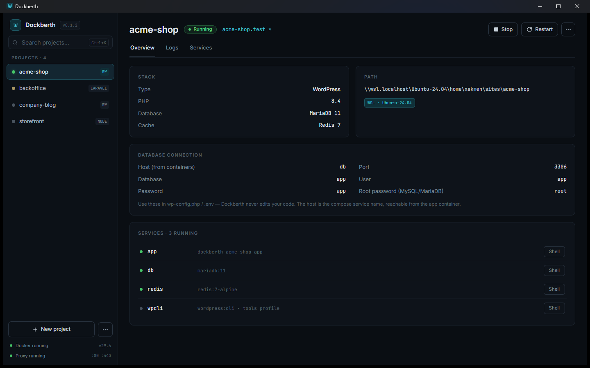

<div align="center">


# Dockberth

**Local dev environments on Windows. Pick a preset, press Start, open `myapp.test`.**

Docker under the hood — a clean desktop app on top.
No compose files to write, no ports to memorize, no terminal required.

[](https://github.com/xakmen/dockberth/releases/latest)
[](https://github.com/xakmen/dockberth/releases)
[](https://github.com/xakmen/dockberth/actions)
[](LICENSE)

[**Download for Windows**](https://github.com/xakmen/dockberth/releases/latest) · [Website](https://dockberth.dev) · [How it works](#how-it-works) · [Contributing](CONTRIBUTING.md)



</div>

## Why Dockberth?

Every local project starts the same way: copy a `docker-compose.yml` from the
last one, fix the port collisions, edit the hosts file as admin, keep three
terminal tabs alive. Dockberth replaces that ritual with a desktop app:

1. **Add a project folder** (or create a new one from scratch) and pick a
   preset — WordPress, Laravel, Vendure, or generic PHP/Node.
2. **Press Start.** Dockberth generates the Docker Compose environment, builds
   the containers, and wires the project into a shared reverse proxy.
3. **Open `https://myapp.test`.** Every project gets its own local domain —
   run as many side by side as you like, they never fight over ports.

## Features

- **Preset-driven** — one click gives you a complete stack: app container,
  database, cache, correct PHP/Node version. Adding a new framework is
  [a single JSON file](docs/PRESETS.md), not a fork of the app.
- **Create WordPress sites from scratch** — only Docker required, no local
  PHP or WP-CLI install (Laravel and Vendure scaffolding are next).
- **Pretty local domains** — a shared [Traefik](https://traefik.io) proxy on
  ports 80/443 routes every project as `<name>.test` (suffix configurable).
- **Hosts file managed for you** — a small elevated helper makes surgical
  edits inside a clearly marked block; one UAC prompt, nothing else touched.
- **WSL2-aware** — projects living inside a WSL2 distro run Compose
  in-distro for native filesystem speed; NTFS projects run natively.
  The app shows you which is which.
- **Built-in logs and shell** — follow container logs per project and open a
  shell into any service straight from the UI.
- **Non-invasive by design** — everything generated lives in a `.dockberth/`
  folder inside your project. Delete it, and Dockberth was never there.
  Your code is never modified.
- **Takes care of itself** — Docker status at a glance (it can start Docker
  Desktop for you), proxy self-heal, signed auto-updates.

<div align="center">
<table>
  <tr>
    <td align="center"><b>Live logs, filtered per service</b></td>
    <td align="center"><b>A new site in one dialog</b></td>
  </tr>
  <tr>
    <td></td>
    <td></td>
  </tr>
</table>
</div>

## Supported stacks

| Stack              | Run existing project | Create from scratch |
| ------------------ | :------------------: | :-----------------: |
| WordPress          |          ✅          |         ✅          |
| Laravel            |          ✅          |       planned       |
| Vendure            |          ✅          |       planned       |
| PHP (generic)      |          ✅          |          —          |
| Node.js (generic)  |          ✅          |          —          |

On the roadmap: Yii, CodeIgniter, OpenCart, Drupal — each is just a preset
file. See [docs/PRESETS.md](docs/PRESETS.md) if you want to contribute one.

## Getting started

**Requirements**

- Windows 10/11
- [Docker Desktop](https://www.docker.com/products/docker-desktop/)
  (WSL2 backend recommended)

**Install**

1. Grab the installer from the
   [latest release](https://github.com/xakmen/dockberth/releases/latest).
2. Run it — Dockberth keeps itself up to date with signed auto-updates.
3. Click **New project** to scaffold a fresh site, or point Dockberth at an
   existing project folder and pick a preset.

## How it works

```
your-project/
├── .dockberth/            ← generated by Dockberth (safe to delete)
│   ├── docker-compose.yml
│   ├── app.Dockerfile
│   └── config.json        ← the only file you'd ever edit
└── … your code (never touched)
```

- Dockberth renders a Docker Compose file from a base template plus a
  framework preset and keeps it in `.dockberth/` inside your project.
- A single global **Traefik** container owns ports 80/443 and routes each
  `<name>.test` domain to the right project via Docker labels.
- Hosts-file entries live in a Dockberth-managed block, written only by a
  separate elevated helper — the app itself never runs as admin.
- Projects on WSL2 paths run Compose inside the distro
  (`wsl.exe -d <distro>`); projects on NTFS run it directly on Windows.

Deep dive: [docs/ARCHITECTURE.md](docs/ARCHITECTURE.md).

## Privacy

No telemetry, no crash reporting, no phoning home — Dockberth sends nothing.
The **Report a bug** action only prefills a GitHub issue that you review and
submit yourself.

## Roadmap

- TLS for `*.test` domains
- Laravel and Vendure scaffolding from scratch
- More framework presets (Yii, CodeIgniter, OpenCart, Drupal)
- macOS and Linux ports

## Contributing & development

Dockberth is Tauri 2 + React + TypeScript, with a thin Rust layer that only
wraps external CLIs (`docker`, `wsl.exe`).

Prerequisites: Node.js ≥ 20, Rust (stable, MSVC), and the
[Tauri prerequisites](https://tauri.app/start/prerequisites/) for Windows.

```sh
npm install
npm run tauri dev
```

Read [CONTRIBUTING.md](CONTRIBUTING.md) before opening a pull request
(DCO sign-off required), and [docs/ARCHITECTURE.md](docs/ARCHITECTURE.md)
for how the pieces fit together.

## License

**The Dockberth core is MIT-licensed, forever.** See [LICENSE](LICENSE).
