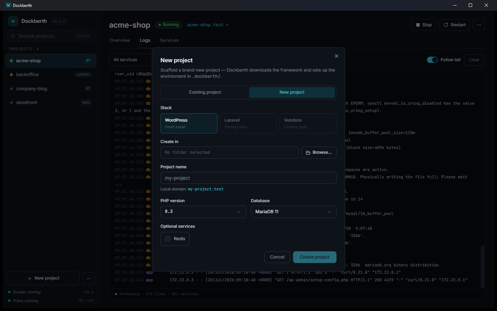

There are two ways to get a project into Dockberth: create a brand-new site
from scratch, or point it at code you already have.

## Option A — create a new site

1. Click **New project**.
2. Pick a name — it becomes the local domain (`myshop` → `myshop.test`) —
   and where the files should live.
3. Choose the stack (WordPress today; Laravel and Vendure scaffolding are
   on the roadmap) plus PHP version and database.
4. Dockberth downloads the framework using a one-off container — no local
   PHP or WP-CLI needed — then generates the environment.

## Option B — add an existing project

1. Click **Add project** and select your project folder.
2. Dockberth detects the framework from marker files (e.g. `artisan`,
   `wp-config.php`, `package.json`) and suggests a preset — confirm or
   pick another.

More detail in [Add an existing project](/guides/add-existing-project/).

## Start it

Press **Start**. Dockberth will:

- render a `docker-compose.yml` into `.dockberth/` inside the project,
- build and start the containers (app, database, and any extras the preset
  defines),
- make sure the shared Traefik proxy is running,
- add `<name>.test` to your hosts file via a single UAC prompt.

When the status turns green, open **`http://myapp.test`** in your browser.
Start as many projects as you like — they share the proxy and never collide
on ports.

## Where to go next

- [Domains and the hosts file](/guides/domains-and-hosts/) — how `.test`
  domains work.
- [Logs and shell](/guides/logs-and-shell/) — watch your containers and get
  a shell inside them.
- [Troubleshooting](/reference/troubleshooting/) — if something didn't go
  green.
