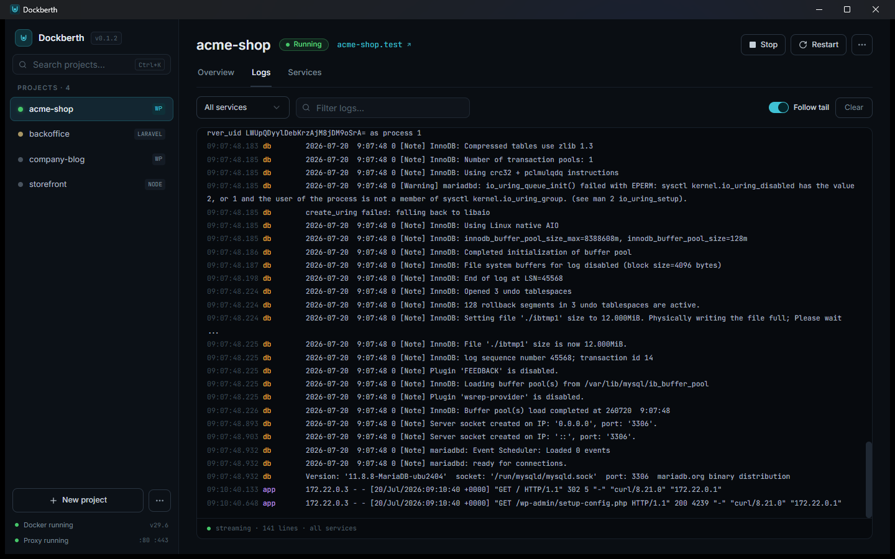

Dockberth keeps you out of terminal-tab juggling: the two things you
actually need from a running environment — logs and a shell — are built into
the app.

## Logs

Each project has a **Logs** tab that streams output from its containers:

- **Per-service filtering** — see everything, or just the app, database,
  or any other service.
- **Search** — find that one error without scrolling.
- **Follow tail** — keep the newest lines in view while the environment
  runs.

Logs are color-coded per service, so a MariaDB warning doesn't look like an
nginx request line.

## Shell

Need to run an artisan command, a `wp` command, or poke at the database?
Open a **shell into any service** of a project directly from the UI — no
`docker ps`, no copying container IDs, no
`docker compose -f .dockberth/docker-compose.yml exec …` incantations.

The shell opens in the right container with the project's files in place.
A few things you might use it for:

- `php artisan migrate` in a Laravel app container
- `wp plugin list` via the WP-CLI companion in a WordPress project
- `npm install` inside a Node container
  ([required on NTFS](/guides/wsl2-and-file-paths/))
- `mariadb`/`psql` clients inside the database service
